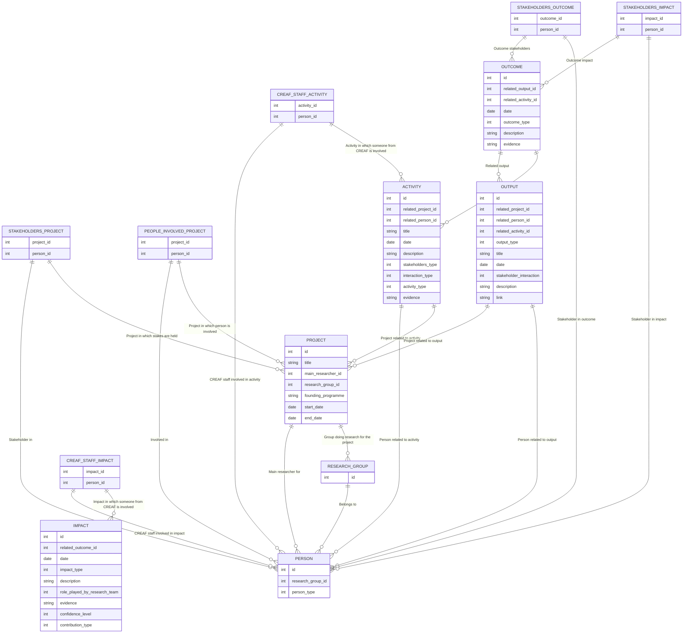

# rims_db_definition

## Notes

- Decisió relació persona/grup recerca. Per exemple, a PROJECT cal tenir el research_group_id, quan ja està disponible a través de main_researcher_id? El mateix passa a ACTIVITY

- PERSON és sempre gent, o poden ser organitzacions?

## Esquema



## DDL

```sql
CREATE TABLE "person" (
    "id" SERIAL PRIMARY KEY,
    "research_group_id" INTEGER,
    "person_type" INTEGER
);

CREATE TABLE "research_group" (
    "id" SERIAL PRIMARY KEY
);

CREATE TABLE "project" (
    "id" SERIAL PRIMARY KEY,
    "title" TEXT,
    "main_researcher_id" INTEGER,
    "research_group_id" INTEGER,
    "founding_programme" TEXT,
    "start_date" DATE,
    "end_date" DATE
);

CREATE TABLE "stakeholders_project" (
    "id" SERIAL PRIMARY KEY,
    "project_id" INTEGER,
    "person_id" INTEGER
);

CREATE TABLE "people_involved_project" (
    "id" SERIAL PRIMARY KEY,
    "project_id" INTEGER,
    "person_id" INTEGER
);

CREATE TABLE "activity" (
    "id" SERIAL PRIMARY KEY,
    "related_project_id" INTEGER,
    "related_person_id" INTEGER,
    "title" TEXT,
    "date" DATE,
    "description" TEXT,
    "stakeholders_type" INTEGER,
    "interaction_type" INTEGER,
    "activity_type" INTEGER,
    "evidence" TEXT
);

CREATE TABLE "creaf_staff_activity" (
    "id" SERIAL PRIMARY KEY,
    "activity_id" INTEGER,
    "person_id" INTEGER
);

CREATE TABLE "output" (
    "id" SERIAL PRIMARY KEY,
    "related_project_id" INTEGER,
    "related_person_id" INTEGER,
    "related_activity_id" INTEGER,
    "output_type" INTEGER,
    "title" TEXT,
    "date" DATE,
    "stakeholder_interaction" INTEGER,
    "description" TEXT,
    "link" TEXT
);

CREATE TABLE "stakeholders_outcome" (
    "id" SERIAL PRIMARY KEY,
    "outcome_id" INTEGER,
    "person_id" INTEGER
);

CREATE TABLE "outcome" (
    "id" SERIAL PRIMARY KEY,
    "related_output_id" INTEGER,
    "related_activity_id" INTEGER,
    "date" DATE,
    "outcome_type" INTEGER,
    "description" TEXT,
    "evidence" TEXT
);

CREATE TABLE "impact" (
    "id" SERIAL PRIMARY KEY,
    "related_outcome_id" INTEGER,
    "date" DATE,
    "impact_type" INTEGER,
    "description" TEXT,
    "role_played_by_research_team" INTEGER,
    "evidence" TEXT,
    "confidence_level" INTEGER,
    "contribution_type" INTEGER
);

CREATE TABLE "stakeholders_impact" (
    "id" SERIAL PRIMARY KEY,
    "impact_id" INTEGER,
    "person_id" INTEGER
);

CREATE TABLE "creaf_staff_impact" (
    "id" SERIAL PRIMARY KEY,
    "impact_id" INTEGER,
    "person_id" INTEGER
);

ALTER TABLE "person"
    ADD CONSTRAINT "fk_person_research_group_id"
    FOREIGN KEY ("research_group_id") REFERENCES "research_group"("id");

ALTER TABLE "project"
    ADD CONSTRAINT "fk_main_research_id"
    FOREIGN KEY ("main_researcher_id") REFERENCES "person"("id");

ALTER TABLE "project"
    ADD CONSTRAINT "fk_research_group_id"
    FOREIGN KEY ("research_group_id") REFERENCES "research_group"("id");

ALTER TABLE "stakeholders_project"
	ADD CONSTRAINT "fk_stakeholders_project_id"
	FOREIGN KEY ("project_id") REFERENCES "project"("id");

ALTER TABLE "stakeholders_project"
	ADD CONSTRAINT "fk_stakeholders_person_id"
	FOREIGN KEY ("person_id") REFERENCES "person"("id");

ALTER TABLE "people_involved_project"
	ADD CONSTRAINT "fk_people_involved_project_id"
	FOREIGN KEY ("project_id") REFERENCES "project"("id");

ALTER TABLE "people_involved_project"
	ADD CONSTRAINT "fk_people_involved_person_id"
	FOREIGN KEY ("person_id") REFERENCES "person"("id");

ALTER TABLE "activity"
	ADD CONSTRAINT "fk_activity_project_id"
	FOREIGN KEY ("related_project_id") REFERENCES "project"("id");
	
ALTER TABLE "activity"
	ADD CONSTRAINT "fk_activity_person_id"
	FOREIGN KEY ("related_person_id") REFERENCES "person"("id");

ALTER TABLE "creaf_staff_activity"
	ADD CONSTRAINT "fk_creaf_staff_activity_activity_id"
	FOREIGN KEY ("activity_id") REFERENCES "activity"("id");
	
ALTER TABLE "creaf_staff_activity"
	ADD CONSTRAINT "fk_creaf_staff_activity_person_id"
	FOREIGN KEY ("person_id") REFERENCES "person"("id");

ALTER TABLE "output"
	ADD CONSTRAINT "fk_output_related_project_id"
	FOREIGN KEY ("related_project_id") REFERENCES "project"("id");

ALTER TABLE "output"
	ADD CONSTRAINT "fk_output_related_person_id"
	FOREIGN KEY ("related_person_id") REFERENCES "person"("id");

ALTER TABLE "output"
	ADD CONSTRAINT "fk_output_related_activity_id"
	FOREIGN KEY ("related_activity_id") REFERENCES "activity"("id");

ALTER TABLE "stakeholders_outcome"
	ADD CONSTRAINT "fk_stakeholders_outcome_outcome_id"
	FOREIGN KEY ("outcome_id") REFERENCES "outcome"("id");

ALTER TABLE "stakeholders_outcome"
	ADD CONSTRAINT "fk_stakeholders_outcome_person_id"
	FOREIGN KEY ("person_id") REFERENCES "person"("id");

ALTER TABLE "outcome"
	ADD CONSTRAINT "fk_outcome_related_output_id"
	FOREIGN KEY ("related_output_id") REFERENCES "output"("id");

ALTER TABLE "outcome"
	ADD CONSTRAINT "fk_outcome_related_activity_id"
	FOREIGN KEY ("related_activity_id") REFERENCES "activity"("id");

ALTER TABLE "impact"
	ADD CONSTRAINT "fk_impact_related_outcome_id"
	FOREIGN KEY ("related_outcome_id") REFERENCES "outcome"("id");

ALTER TABLE "stakeholders_impact"
	ADD CONSTRAINT "fk_stakeholders_impact_impact_id"
	FOREIGN KEY ("impact_id") REFERENCES "impact"("id");
	
ALTER TABLE "stakeholders_impact"
	ADD CONSTRAINT "fk_stakeholders_impact_person_id"
	FOREIGN KEY ("person_id") REFERENCES "person"("id");

ALTER TABLE "creaf_staff_impact"
	ADD CONSTRAINT "fk_creaf_staff_impact_impact_id"
	FOREIGN KEY ("impact_id") REFERENCES "impact"("id");

ALTER TABLE "creaf_staff_impact"
	ADD CONSTRAINT "fk_creaf_staff_impact_person_id"
	FOREIGN KEY ("person_id") REFERENCES "person"("id");
```