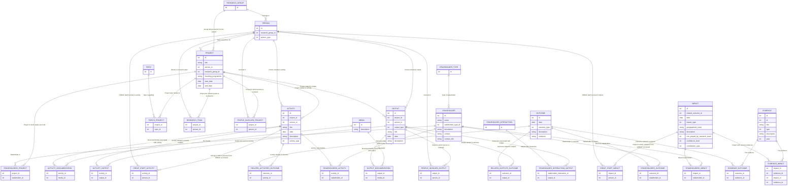

# rims_db_definition

## Notes

v.1

- Decisió relació persona/grup recerca. Per exemple, a PROJECT cal tenir el research_group_id, quan ja està disponible a través de main_researcher_id? El mateix passa a ACTIVITY

- Outcome es relaciona amb activitat i output, però output ja es relaciona amb activitat. Similar al cas persona/grup recerca.

- Output es relaciona amb activitat i projecte, però activitat ja es relaciona amb projecte.

- PERSON és sempre gent, o poden ser organitzacions?

v.2

- Canvis

- Afegida taula topic, relació projecte(n):topics(m)
- Afegida taula stakeholders_activity, relació activity(n):person(m)
- Afegida taula stakeholder_type
- Afegida taula stakeholder, diferent de persona

- Stakeholders estan a activity i project
- Moure stakeholder_type a tesaure stakeholder?

## Esquema


```mermaid
erDiagram
MEDIA{
    int id
    string description
}

STAKEHOLDER{
    int id
    string name
    int stakeholder_type_id
    string description
    string contact
    string contact_info
}

STAKEHOLDER_TYPE{
    int id
}

PERSON{
    int id
    int research_group_id
    int person_type
}

RESEARCH_GROUP{
    int id
}

PROJECT{
    int id
    string title
    int person_id
    int research_group_id
    string founding_programme
    date start_date
    date end_date
}

TOPIC{
    int id
}

TOPICS_PROJECT{
    int project_id
    int topic_id
}

RESEARCH_TEAM{
    int project_id
    int person_id
}

STAKEHOLDERS_PROJECT{
    int project_id
    int stakeholder_id
}

PEOPLE_INVOLVED_PROJECT{
    int project_id
    int person_id
}

ACTIVITY{
    int id
    int project_id
    int person_id
    string title
    date date
    string description
    int activity_type
}

ACTIVITY_DOCUMENTATION{
    int activity_id
    int media_id
}

STAKEHOLDERS_ACTIVITY{
    int activity_id
    int stakeholder_id    
}

CREAF_STAFF_ACTIVITY{
    int activity_id
    int person_id
}

OUTPUT{
    int id
    int project_id
    int person_id    
    int output_type
    string title
    date date    
    string description    
}

OUTPUT_DOCUMENTATION{
    int output_id
    int media_id
}

STAKEHOLDER_INTERACTION{
    int id
}

STAKEHOLDER_INTERACTION_OUTPUT{
    int stakeholder_interaction_id
    int output_id
}

PEOPLE_INVOLVED_OUTPUT{
    int output_id
    int person_id
}

ACTIVITY_OUTPUT{
    int activity_id
    int output_id
}

OUTCOME{
    int id    
    date date
    int outcome_type
    string description
    string evidence
}

EVIDENCE{
    int id
}

STAKEHOLDERS_OUTCOME{
    int outcome_id
    int stakeholder_id
}

EVIDENCE_OUTCOME{
    int outcome_id
    int evidence_id
}

RELATED_ACTIVITIES_OUTCOME{
    int outcome_id
    int activity_id
}

RELATED_OUTPUTS_OUTCOME{
    int outcome_id
    int output_id
}

IMPACT{
    int id
    int related_outcome_id
    date date
    int impact_type
    string geographical_scale
    string description
    int role_played_by_research_team    
    int confidence_level
    int contribution_type
}

EVIDENCE{
    int id
    string title
    int type
    string description
    int year
}

EVIDENCE_IMPACT{
    int impact_id
    int evidence_id
}

STAKEHOLDERS_IMPACT{
    int impact_id
    int stakeholder_id
}

CREAF_STAFF_IMPACT{
    int impact_id
    int person_id
}

EVIDENCE_IMPACT{
    int impact_id
    int evidence_id
}

STAKEHOLDER_TYPE ||--o{ STAKEHOLDER: "Type of stakeholder"
RESEARCH_GROUP ||--o{ PERSON : "Belongs to"
ACTIVITY ||--o{ ACTIVITY_DOCUMENTATION : "Document/media associated with activity"
MEDIA ||--o{ ACTIVITY_DOCUMENTATION : "The media"
OUTPUT ||--o{ OUTPUT_DOCUMENTATION : "Document/media associated with output"
MEDIA ||--o{  OUTPUT_DOCUMENTATION: "The media"
PERSON ||--o{ PROJECT : "Main researcher for"
RESEARCH_GROUP ||--o{ PROJECT: "Group doing research for the project"
STAKEHOLDER ||--o{ STAKEHOLDERS_PROJECT: "Stakeholder in"
PROJECT ||--o{ STAKEHOLDERS_PROJECT : "Project in which stakes are held"
PERSON ||--o{ PEOPLE_INVOLVED_PROJECT : "Involved in"
PROJECT ||--o{ PEOPLE_INVOLVED_PROJECT : "Project in which person is involved"
PERSON ||--o{ PEOPLE_INVOLVED_OUTPUT : "Involved in"
OUTPUT ||--o{ PEOPLE_INVOLVED_OUTPUT : "Output in which person is involved"
PERSON ||--o{ RESEARCH_TEAM : "Person in research team"
PROJECT ||--o{ RESEARCH_TEAM : "Project the research team is involved in"
TOPIC ||--o{ TOPICS_PROJECT : "Topic regarding"
PROJECT ||--o{ TOPICS_PROJECT : "Project topic relates to"
PERSON ||--o{ ACTIVITY : "Person related to activity" 
PROJECT  ||--o{ ACTIVITY : "Project related to activity" 
ACTIVITY ||--o{ ACTIVITY_OUTPUT : "Activity related to several outputs" 
OUTPUT ||--o{ ACTIVITY_OUTPUT : "Output derived from activity" 
PERSON ||--o{ CREAF_STAFF_ACTIVITY : "CREAF staff involved in activity"
ACTIVITY ||--o{ CREAF_STAFF_ACTIVITY : "Activity in which someone from CREAF is involved"
PROJECT ||--o{ OUTPUT : "Project related to output"
PERSON ||--o{ OUTPUT : "Person related to output"
OUTCOME ||--o{ RELATED_ACTIVITIES_OUTCOME : "Outcome related to activities"
ACTIVITY ||--o{ RELATED_ACTIVITIES_OUTCOME : "Activity related to outcome"
OUTCOME ||--o{ RELATED_OUTPUTS_OUTCOME : "Outcome related to outputs"
OUTPUT ||--o{ RELATED_OUTPUTS_OUTCOME : "Output related to outcome"
OUTCOME ||--o{ EVIDENCE_OUTCOME : "Outcome related to evidence"
EVIDENCE ||--o{ EVIDENCE_OUTCOME : "The evidence"
ACTIVITY ||--o{ STAKEHOLDERS_ACTIVITY : "Activity stakeholders"
STAKEHOLDER ||--o{ STAKEHOLDERS_ACTIVITY : "Stakeholder in activity"
OUTCOME ||--o{ STAKEHOLDERS_OUTCOME : "Outcome stakeholders"
STAKEHOLDER ||--o{ STAKEHOLDERS_OUTCOME : "Stakeholder in outcome"
IMPACT ||--o{ STAKEHOLDERS_IMPACT : "Impact stakeholders"
STAKEHOLDER ||--o{ STAKEHOLDERS_IMPACT : "Stakeholder in impact"
PERSON ||--o{ CREAF_STAFF_IMPACT : "CREAF staff involved in impact"
IMPACT ||--o{ CREAF_STAFF_IMPACT : "Impact in which someone from CREAF is involved"
IMPACT ||--o{ EVIDENCE_IMPACT : "Impact with several evidences"
EVIDENCE ||--o{ EVIDENCE_IMPACT  : "The evidence"
STAKEHOLDER_INTERACTION ||--o{ STAKEHOLDER_INTERACTION_OUTPUT : "Stakeholder interaction"
OUTPUT ||--o{ STAKEHOLDER_INTERACTION_OUTPUT: "Interaction associated with output"
```

## DDL

```sql
CREATE TABLE "media" (
    "id" SERIAL PRIMARY KEY,
    "description" TEXT
);

CREATE TABLE "stakeholder" (
    "id" SERIAL PRIMARY KEY,
    "name" TEXT,
    "stakeholder_type_id" INTEGER,
    "description" TEXT,
    "contact" TEXT,
    "contact_info" TEXT
);

CREATE TABLE "stakeholder_type" (
    "id" SERIAL PRIMARY KEY
);

CREATE TABLE "person" (
    "id" SERIAL PRIMARY KEY,
    "research_group_id" INTEGER,
    "person_type" INTEGER
);

CREATE TABLE "research_group" (
    "id" SERIAL PRIMARY KEY
);

CREATE TABLE "project" (
    "id" SERIAL PRIMARY KEY,
    "title" TEXT,
    "main_researcher_id" INTEGER,
    "research_group_id" INTEGER,
    "founding_programme" TEXT,
    "start_date" DATE,
    "end_date" DATE
);

CREATE TABLE "topic" (
    "id" SERIAL PRIMARY KEY
);

CREATE TABLE "topics_project" (
    "id" SERIAL PRIMARY KEY,
    "project_id" INTEGER,
    "topic_id" INTEGER
);

CREATE TABLE "research_team" (
    "id" SERIAL PRIMARY KEY,
    "project_id" INTEGER,
    "person_id" INTEGER
);

CREATE TABLE "stakeholders_project" (
    "id" SERIAL PRIMARY KEY,
    "project_id" INTEGER,
    "stakeholder_id" INTEGER
);

CREATE TABLE "people_involved_project" (
    "id" SERIAL PRIMARY KEY,
    "project_id" INTEGER,
    "person_id" INTEGER
);

CREATE TABLE "activity" (
    "id" SERIAL PRIMARY KEY,
    "related_project_id" INTEGER,
    "related_person_id" INTEGER,
    "title" TEXT,
    "date" DATE,
    "description" TEXT,
    "activity_type" INTEGER
);

CREATE TABLE "activity_documentation" (
    "id" SERIAL PRIMARY KEY,
    "activity_id" INTEGER,
    "media_id" INTEGER
);

CREATE TABLE "stakeholders_activity" (
    "id" SERIAL PRIMARY KEY,
    "activity_id" INTEGER,
    "stakeholder_id" INTEGER
);

CREATE TABLE "creaf_staff_activity" (
    "id" SERIAL PRIMARY KEY,
    "activity_id" INTEGER,
    "person_id" INTEGER
);

CREATE TABLE "output" (
    "id" SERIAL PRIMARY KEY,
    "related_project_id" INTEGER,
    "related_person_id" INTEGER,
    "output_type" INTEGER,
    "title" TEXT,
    "date" DATE,
    "description" TEXT
);

CREATE TABLE "output_documentation" (
    "id" SERIAL PRIMARY KEY,
    "output_id" INTEGER,
    "media_id" INTEGER
);

CREATE TABLE "stakeholder_interaction" (
    "id" SERIAL PRIMARY KEY
);

CREATE TABLE "stakeholder_interaction_output" (
    "id" SERIAL PRIMARY KEY,
    "stakeholder_interaction_id" INTEGER,
    "output_id" INTEGER
);

CREATE TABLE "people_involved_output" (
    "id" SERIAL PRIMARY KEY,
    "output_id" INTEGER,
    "person_id" INTEGER
);

CREATE TABLE "activity_output" (
    "id" SERIAL PRIMARY KEY,
    "activity_id" INTEGER,
    "output_id" INTEGER
);

CREATE TABLE "outcome" (
    "id" SERIAL PRIMARY KEY,
    "date" DATE,
    "outcome_type" INTEGER,
    "description" TEXT,
    "evidence" TEXT
);

CREATE TABLE "evidence" (
    "id" SERIAL PRIMARY KEY,
    "title" TEXT,
    "type" INTEGER,
    "description" TEXT,
    "year" INTEGER
);

CREATE TABLE "stakeholders_outcome" (
    "id" SERIAL PRIMARY KEY,
    "outcome_id" INTEGER,
    "stakeholder_id" INTEGER
);

CREATE TABLE "evidence_outcome" (
    "id" SERIAL PRIMARY KEY,
    "outcome_id" INTEGER,
    "evidence_id" INTEGER
);

CREATE TABLE "related_activities_outcome" (
    "id" SERIAL PRIMARY KEY,
    "id_outcome" INTEGER,
    "id_activity" INTEGER
);

CREATE TABLE "related_outputs_outcome" (
    "id" SERIAL PRIMARY KEY,
    "id_outcome" INTEGER,
    "id_output" INTEGER
);

CREATE TABLE "impact" (
    "id" SERIAL PRIMARY KEY,
    "related_outcome_id" INTEGER,
    "date" DATE,
    "impact_type" INTEGER,
    "geographical_scale" TEXT,
    "description" TEXT,
    "role_played_by_research_team" INTEGER,
    "confidence_level" INTEGER,
    "contribution_type" INTEGER
);

CREATE TABLE "evidence_impact" (
    "id" SERIAL PRIMARY KEY,
    "impact_id" INTEGER,
    "evidence_id" INTEGER
);

CREATE TABLE "stakeholders_impact" (
    "id" SERIAL PRIMARY KEY,
    "impact_id" INTEGER,
    "stakeholder_id" INTEGER
);

CREATE TABLE "creaf_staff_impact" (
    "id" SERIAL PRIMARY KEY,
    "impact_id" INTEGER,
    "person_id" INTEGER
);

ALTER TABLE "stakeholder"
    ADD CONSTRAINT "fk_stakeholder_stakeholder_type_id"
    FOREIGN KEY ("stakeholder_type_id") REFERENCES "stakeholder_type"("id");

ALTER TABLE "person"
    ADD CONSTRAINT "fk_person_research_group_id"
    FOREIGN KEY ("research_group_id") REFERENCES "research_group"("id");

ALTER TABLE "activity_documentation"
    ADD CONSTRAINT "fk_activity_documentation_activity_id"
    FOREIGN KEY ("activity_id") REFERENCES "activity"("id");

ALTER TABLE "activity_documentation"
    ADD CONSTRAINT "fk_activity_documentation_media_id"
    FOREIGN KEY ("media_id") REFERENCES "media"("id");

ALTER TABLE "output_documentation"
    ADD CONSTRAINT "fk_output_documentation_output_id"
    FOREIGN KEY ("output_id") REFERENCES "output"("id");

ALTER TABLE "output_documentation"
    ADD CONSTRAINT "fk_output_documentation_media_id"
    FOREIGN KEY ("media_id") REFERENCES "media"("id");

ALTER TABLE "project"
    ADD CONSTRAINT "fk_project_person_id"
    FOREIGN KEY ("person_id") REFERENCES "person"("id");

ALTER TABLE "project"
    ADD CONSTRAINT "fk_project_research_group_id"
    FOREIGN KEY ("research_group_id") REFERENCES "research_group"("id");

ALTER TABLE "stakeholders_project"
    ADD CONSTRAINT "fk_stakeholders_project_stakeholder_id"
    FOREIGN KEY ("stakeholder_id") REFERENCES "stakeholder"("id");

ALTER TABLE "stakeholders_project"
    ADD CONSTRAINT "fk_stakeholders_project_project_id"
    FOREIGN KEY ("project_id") REFERENCES "project"("id");

ALTER TABLE "people_involved_project"
    ADD CONSTRAINT "fk_people_involved_project_person_id"
    FOREIGN KEY ("person_id") REFERENCES "person"("id");

ALTER TABLE "people_involved_project"
    ADD CONSTRAINT "fk_people_involved_project_project_id"
    FOREIGN KEY ("project_id") REFERENCES "project"("id");

ALTER TABLE "people_involved_output"
    ADD CONSTRAINT "fk_people_involved_output_person_id"
    FOREIGN KEY ("person_id") REFERENCES "person"("id");

ALTER TABLE "people_involved_output"
    ADD CONSTRAINT "fk_people_involved_output_output_id"
    FOREIGN KEY ("output_id") REFERENCES "output"("id");

ALTER TABLE "research_team"
    ADD CONSTRAINT "fk_research_team_person_id"
    FOREIGN KEY ("person_id") REFERENCES "person"("id");

ALTER TABLE "research_team"
    ADD CONSTRAINT "fk_research_team_project_id"
    FOREIGN KEY ("project_id") REFERENCES "project"("id");

ALTER TABLE "topics_project"
    ADD CONSTRAINT "fk_topics_project_topic_id"
    FOREIGN KEY ("topic_id") REFERENCES "topic"("id");

ALTER TABLE "topics_project"
    ADD CONSTRAINT "fk_topics_project_project_id"
    FOREIGN KEY ("project_id") REFERENCES "project"("id");

ALTER TABLE "activity"
    ADD CONSTRAINT "fk_activity_person_id"
    FOREIGN KEY ("person_id") REFERENCES "person"("id");

ALTER TABLE "activity"
    ADD CONSTRAINT "fk_activity_project_id"
    FOREIGN KEY ("project_id") REFERENCES "project"("id");

ALTER TABLE "activity_output"
    ADD CONSTRAINT "fk_activity_output_activity_id"
    FOREIGN KEY ("activity_id") REFERENCES "activity"("id");

ALTER TABLE "activity_output"
    ADD CONSTRAINT "fk_activity_output_output_id"
    FOREIGN KEY ("output_id") REFERENCES "output"("id");

ALTER TABLE "creaf_staff_activity"
    ADD CONSTRAINT "fk_creaf_staff_activity_person_id"
    FOREIGN KEY ("person_id") REFERENCES "person"("id");

ALTER TABLE "creaf_staff_activity"
    ADD CONSTRAINT "fk_creaf_staff_activity_activity_id"
    FOREIGN KEY ("activity_id") REFERENCES "activity"("id");

ALTER TABLE "project"
    ADD CONSTRAINT "fk_project_output_id"
    FOREIGN KEY ("output_id") REFERENCES "output"("id");

ALTER TABLE "person"
    ADD CONSTRAINT "fk_person_output_id"
    FOREIGN KEY ("output_id") REFERENCES "output"("id");

ALTER TABLE "outcome"
    ADD CONSTRAINT "fk_outcome_related_activities_outcome_id"
    FOREIGN KEY ("related_activities_outcome_id") REFERENCES "related_activities_outcome"("id");

ALTER TABLE "activity"
    ADD CONSTRAINT "fk_activity_related_activities_outcome_id"
    FOREIGN KEY ("related_activities_outcome_id") REFERENCES "related_activities_outcome"("id");

ALTER TABLE "outcome"
    ADD CONSTRAINT "fk_outcome_related_outputs_outcome_id"
    FOREIGN KEY ("related_outputs_outcome_id") REFERENCES "related_outputs_outcome"("id");

ALTER TABLE "output"
    ADD CONSTRAINT "fk_output_related_outputs_outcome_id"
    FOREIGN KEY ("related_outputs_outcome_id") REFERENCES "related_outputs_outcome"("id");

ALTER TABLE "evidence_outcome"
    ADD CONSTRAINT "fk_evidence_outcome_outcome_id"
    FOREIGN KEY ("outcome_id") REFERENCES "outcome"("id");

ALTER TABLE "evidence_outcome"
    ADD CONSTRAINT "fk_evidence_outcome_evidence_id"
    FOREIGN KEY ("evidence_id") REFERENCES "evidence"("id");

ALTER TABLE "stakeholders_activity"
    ADD CONSTRAINT "fk_stakeholders_activity_activity_id"
    FOREIGN KEY ("activity_id") REFERENCES "activity"("id");

ALTER TABLE "stakeholders_activity"
    ADD CONSTRAINT "fk_stakeholders_activity_stakeholder_id"
    FOREIGN KEY ("stakeholder_id") REFERENCES "stakeholder"("id");

ALTER TABLE "stakeholders_outcome"
    ADD CONSTRAINT "fk_stakeholders_outcome_outcome_id"
    FOREIGN KEY ("outcome_id") REFERENCES "outcome"("id");

ALTER TABLE "stakeholders_outcome"
    ADD CONSTRAINT "fk_stakeholders_outcome_stakeholder_id"
    FOREIGN KEY ("stakeholder_id") REFERENCES "stakeholder"("id");

ALTER TABLE "outcome"
    ADD CONSTRAINT "fk_outcome_stakeholders_impact_id"
    FOREIGN KEY ("stakeholders_impact_id") REFERENCES "stakeholders_impact"("id");

ALTER TABLE "stakeholders_impact"
    ADD CONSTRAINT "fk_stakeholders_impact_stakeholder_id"
    FOREIGN KEY ("stakeholder_id") REFERENCES "stakeholder"("id");

ALTER TABLE "creaf_staff_impact"
    ADD CONSTRAINT "fk_creaf_staff_impact_person_id"
    FOREIGN KEY ("person_id") REFERENCES "person"("id");

ALTER TABLE "creaf_staff_impact"
    ADD CONSTRAINT "fk_creaf_staff_impact_impact_id"
    FOREIGN KEY ("impact_id") REFERENCES "impact"("id");

ALTER TABLE "evidence_impact"
    ADD CONSTRAINT "fk_evidence_impact_impact_id"
    FOREIGN KEY ("impact_id") REFERENCES "impact"("id");

ALTER TABLE "evidence_impact"
    ADD CONSTRAINT "fk_evidence_impact_evidence_id"
    FOREIGN KEY ("evidence_id") REFERENCES "evidence"("id");

ALTER TABLE "stakeholder_interaction_output"
    ADD CONSTRAINT "fk_stakeholder_interaction_output_stakeholder_interaction_id"
    FOREIGN KEY ("stakeholder_interaction_id") REFERENCES "stakeholder_interaction"("id");

ALTER TABLE "stakeholder_interaction_output"
    ADD CONSTRAINT "fk_stakeholder_interaction_output_output_id"
    FOREIGN KEY ("output_id") REFERENCES "output"("id");
```